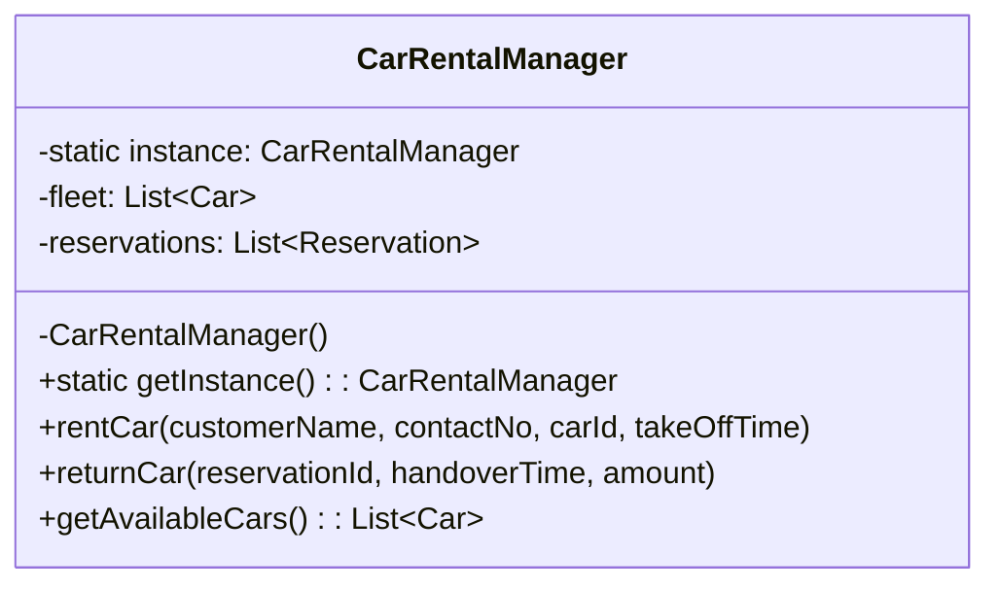

```mermaid
classDiagram
    class CarRentalManager {
        -static instance: CarRentalManager
        -fleet: List~Car~
        -reservations: List~Reservation~

        -CarRentalManager()
        +static getInstance(): CarRentalManager
        +rentCar(customerName, contactNo, carId, takeOffTime)
        +returnCar(reservationId, handoverTime, amount)
        +getAvailableCars(): List~Car~
    }
```