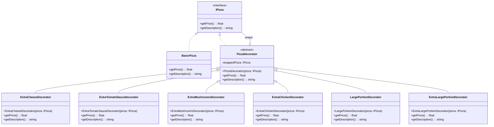

```mermaid
classDiagram
    direction TB

    class IPizza {
        <<interface>>
        +getPrice(): float
        +getDescription(): string
    }

    class BasicPizza {
        +getPrice(): float
        +getDescription(): string
    }

    class PizzaDecorator {
        <<abstract>>
        -wrappedPizza: IPizza
        +PizzaDecorator(pizza: IPizza)
        +getPrice(): float
        +getDescription(): string
    }

    class ExtraCheeseDecorator {
        +ExtraCheeseDecorator(pizza: IPizza)
        +getPrice(): float
        +getDescription(): string
    }
    class ExtraTomatoSauceDecorator {
        +ExtraTomatoSauceDecorator(pizza: IPizza)
        +getPrice(): float
        +getDescription(): string
    }
    class ExtraMushroomsDecorator {
        +ExtraMushroomsDecorator(pizza: IPizza)
        +getPrice(): float
        +getDescription(): string
    }
    class ExtraChickenDecorator {
        +ExtraChickenDecorator(pizza: IPizza)
        +getPrice(): float
        +getDescription(): string
    }
    class LargePortionDecorator {
        +LargePortionDecorator(pizza: IPizza)
        +getPrice(): float
        +getDescription(): string
    }
    class ExtraLargePortionDecorator {
        +ExtraLargePortionDecorator(pizza: IPizza)
        +getPrice(): float
        +getDescription(): string
    }

    IPizza <|.. BasicPizza
    IPizza <|.. PizzaDecorator

    PizzaDecorator <|-- ExtraCheeseDecorator
    PizzaDecorator <|-- ExtraTomatoSauceDecorator
    PizzaDecorator <|-- ExtraMushroomsDecorator
    PizzaDecorator <|-- ExtraChickenDecorator
    PizzaDecorator <|-- LargePortionDecorator
    PizzaDecorator <|-- ExtraLargePortionDecorator

    PizzaDecorator o-- IPizza : wraps
```