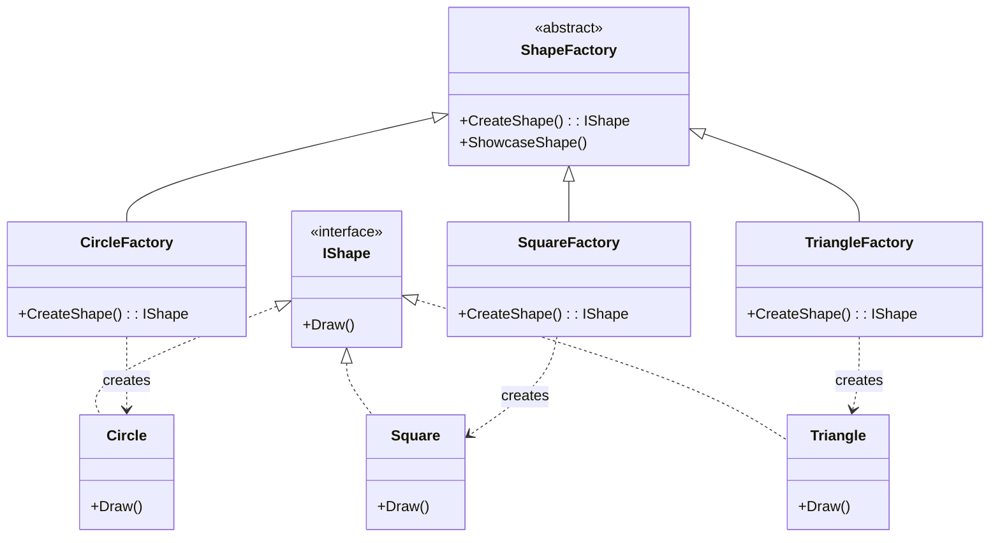

```mermaid
classDiagram
    direction TB

    class IShape {
        <<interface>>
        +Draw()
    }

    class Circle {
        +Draw()
    }

    class Square {
        +Draw()
    }

    class Triangle {
        +Draw()
    }

    class ShapeFactory {
        <<abstract>>
        +CreateShape(): IShape
        +ShowcaseShape()
    }

    class CircleFactory {
        +CreateShape(): IShape
    }

    class SquareFactory {
        +CreateShape(): IShape
    }

    class TriangleFactory {
        +CreateShape(): IShape
    }

    IShape <|.. Circle
    IShape <|.. Square
    IShape <|.. Triangle

    ShapeFactory <|-- CircleFactory
    ShapeFactory <|-- SquareFactory
    ShapeFactory <|-- TriangleFactory

    CircleFactory ..> Circle : creates
    SquareFactory ..> Square : creates
    TriangleFactory ..> Triangle : creates
```